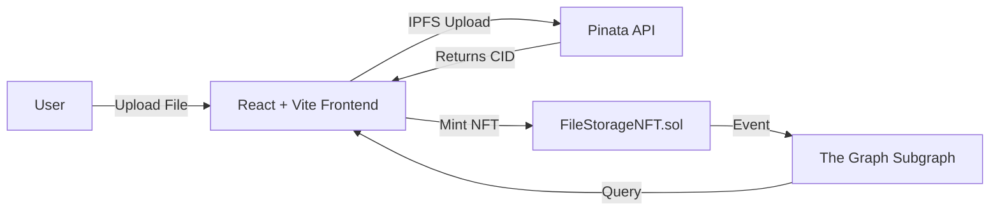

# Storage Forge

A decentralized file storage dApp that lets users upload files to IPFS (via Pinata) and mint an ERC-721 NFT representing ownership on the Ethereum Sepolia testnet.

## Architecture



### Components

| Layer | Technology | Description |
|-------|-----------|-------------|
| **Smart Contract** | Solidity ^0.8.20 + Foundry | ERC-721 contract that mints NFTs for uploaded files |
| **Frontend** | React 19 + Vite + Tailwind CSS v4 | Web UI for wallet connection, file upload, and vault browsing |
| **Blockchain Indexer** | The Graph | Subgraph indexing `FileUploaded` events for easy querying |
| **Storage** | IPFS (via Pinata) | Decentralized file storage with CID-based retrieval |

## Smart Contract

`FileStorageNFT` (`storage_forge/src/FileStorageNFT.sol`) is an ERC-721 token with:

- `uploadFile(string cid, string fileName)` — mints an NFT to the caller and emits a `FileUploaded` event
- `isCIDUsed(string cid)` — checks if a CID has already been uploaded (prevents duplicates)
- Deployed on **Sepolia** testnet (chain ID `11155111`)

### Deployment

```bash
cd storage_forge
forge script script/DeployFileStorage.s.sol --rpc-url $RPC_URL --private-key $PRIVATE_KEY --broadcast
```

### Testing

```bash
cd storage_forge
forge test
```

## Frontend

A React SPA built with Vite that provides:

- **MetaMask** wallet connection
- File selection and IPFS upload via Pinata
- NFT minting via the smart contract
- Vault view — lists all uploaded files by querying the subgraph (or falls back to direct event logs)

### Setup

```bash
cd frontend
cp .env.example .env
# Edit .env with your values
npm install
npm run dev
```

### Environment Variables

| Variable | Description |
|----------|-------------|
| `VITE_CONTRACT_ADDRESS` | Deployed FileStorageNFT contract address |
| `VITE_PINATA_JWT` | Pinata JWT for IPFS uploads |
| `VITE_SUBGRAPH_URL` | The Graph subgraph endpoint |

## Subgraph

Indexes `FileUploaded` events from the contract into a `FileEntity` type with `tokenId`, `uploader`, `cid`, and `fileName` fields.

```bash
cd subgraph
npm run build
npm run deploy
```

## IPFS Gateway

Uploaded files are accessible at `https://gateway.pinata.cloud/ipfs/<CID>`.
